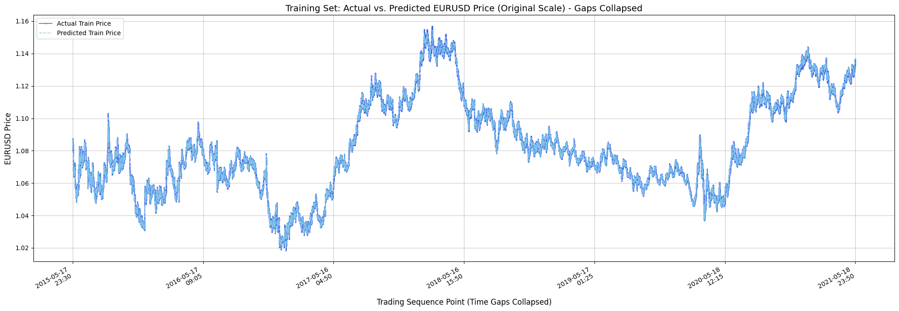
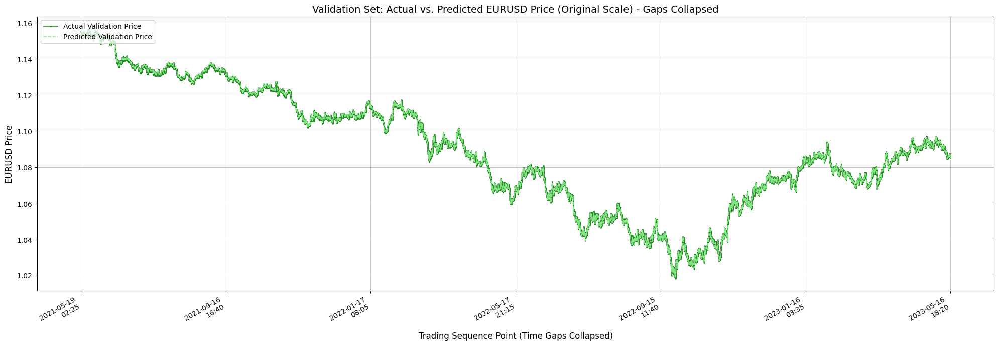
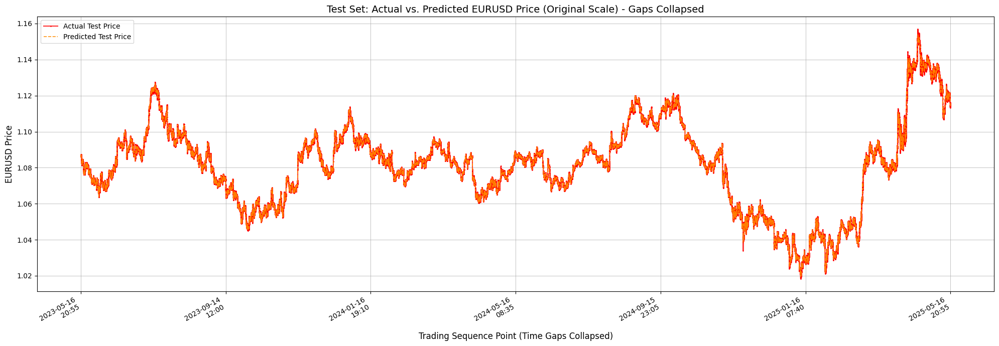
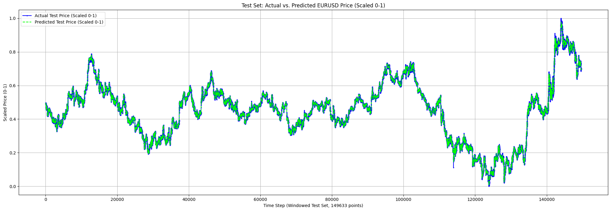

# Applied Machine Learning for Trading: EURUSD Forecasting with LSTM

## Short Description
This project implements a Long Short-Term Memory (LSTM) neural network using TensorFlow/Keras to forecast EURUSD 5-minute closing prices. The approach and exploration are inspired by concepts discussed in the academic work "MACHINE LEARNING APLICADO AL TRADING" by Macarena Salvador Maceira (Universidad Pontificia Comillas, Junio 2019).

## Project Objective
The primary goal is to build and evaluate an LSTM model for short-term currency exchange rate prediction. This serves as a practical exercise in applying deep learning techniques to financial time series data and understanding the nuances involved, as highlighted in related academic research.

## Reference
This project draws inspiration and context from:
*   **Title:** MACHINE LEARNING APLICADO AL TRADING
*   **Author:** Macarena Salvador Maceira
*   **Institution:** Facultad Ciencias Económicas y Empresariales, Universidad Pontificia Comillas
*   **Date:** Junio 2019
    *Note: This project is an independent implementation and exploration, not an official reproduction or extension of the cited work unless explicitly stated.*

## Dataset
*   **Asset:** EURUSD (Euro / US Dollar)
*   **Frequency:** 5-minute intervals
*   **Period:** 1 year (for initial development and tuning)
*   **Source:** `EURUSD_5m_1Yea.csv` (Included in the repository)
*   **Columns used:** `Date`, `Time`, `Close`

## Features
*   Data loading and preprocessing (Pandas).
*   Time series windowing for LSTM input.
*   MinMax scaling of data (Scikit-learn).
*   LSTM model construction using TensorFlow/Keras (Sequential API with LSTM, Dropout, Dense layers).
*   Model training with EarlyStopping callback.
*   Model evaluation using Mean Squared Error (MSE), Root Mean Squared Error (RMSE), and Mean Absolute Error (MAE).
*   Visualization of actual vs. predicted prices on original and scaled data (Matplotlib).

## Technologies Used
*   Python 3.x
*   TensorFlow & Keras
*   Pandas
*   NumPy
*   Scikit-learn
*   Matplotlib

## Setup and Installation
1.  Clone the repository:
    ```bash
    git clone https://github.com/YOUR_USERNAME/applied-ml-trading-lstm-eurusd.git
    cd applied-ml-trading-lstm-eurusd
    ```
2.  (Recommended) Create a virtual environment:
    ```bash
    python -m venv venv
    source venv/bin/activate  # On Windows: venv\Scripts\activate
    ```
3.  Install dependencies:
    ```bash
    pip install -r requirements.txt
    ```
    *(You'll need to create a `requirements.txt` file. You can generate one using `pip freeze > requirements.txt` in your activated environment after installing all necessary packages locally, or list them manually based on your Colab imports).*
    **Minimum `requirements.txt` content:**
    ```
    tensorflow
    pandas
    numpy
    scikit-learn
    matplotlib
    ```

## Usage
The primary code is within the Jupyter Notebook (`Machine_Learning_Applied_to_Trading.ipynb`).
1.  Ensure the dataset (`EURUSD_5m_1Yea.csv`) is in the same directory as the notebook, or update the path in the notebook.
2.  Open and run the cells in the Jupyter Notebook sequentially.
    *   You can run this in Google Colab by uploading the notebook and the CSV file.

## Model Architecture (Example)
The current LSTM model consists of:
*   Input Layer (LSTM with 50 units, return_sequences=True)
*   Dropout Layer (0.2)
*   LSTM Layer (50 units)
*   Dropout Layer (0.2)
*   Dense Output Layer (1 unit)


## Example Results

This section showcases the performance of our optimized LSTM model on the EURUSD 15-minute data, using a 10-year historical dataset. The configuration includes `WINDOW=30`, 2 LSTM Layers (32 units each), `Dropout=0.1`, Adam optimizer (`lr=0.001`), `epochs=20`, `patience=10`, and `batch_size=32`.

**Training Set: Actual vs. Predicted (Original Scale - Gaps Collapsed)**
*This plot displays how well the model learned to fit the training data. Time gaps are visually collapsed to show continuous trading sequences.*



**Validation Set: Actual vs. Predicted (Original Scale - Gaps Collapsed)**
*This plot shows the model's performance on the validation set, which is used for hyperparameter tuning and early stopping. Time gaps are visually collapsed.*



**Test Set: Actual vs. Predicted (Original Scale - Gaps Collapsed)**
*This is a key plot showing the model's generalization ability on completely unseen test data. Time gaps are visually collapsed to focus on predictive accuracy during active trading periods.*



**Test Set: Actual vs. Predicted (Scaled 0-1)**
*This plot shows the test set comparison in the 0-1 scaled range that the LSTM model directly operates on. The x-axis represents the sequence of windowed test set points.*



**Key Evaluation Metrics (Test Set - 10yr/5m/W30/LR0.001 Model):**
*   Mean Absolute Error (MAE): **0.000275 EURUSD** (~2.75 pips)
*   Root Mean Squared Error (RMSE): **0.000443 EURUSD**

*(Note: The MAE/RMSE metrics above are for the 5-minute model with WINDOW=30 as it was the best. Adjust if these plots correspond to a different "best" model, e.g., the 15-minute one.)*

These visualizations and metrics demonstrate the model's capability to make short-term price predictions with a high degree of accuracy. For a detailed breakdown of all hyperparameter tuning experiments, please refer to the [EXPERIMENTS.md](EXPERIMENTS.md) file.


## Hyperparameter Tuning Experiments
Details on experiments conducted for hyperparameter tuning (e.g., `WINDOW` size optimization) can be found in [EXPERIMENTS.md](EXPERIMENTS.md).

## Future Work & Improvements
*   Extensive hyperparameter tuning (WINDOW size, LSTM units, layers, dropout rates, batch size, learning rate).
*   Testing with larger datasets (5-year, 10-year historical data).
*   Incorporating additional features (e.g., trading volume, technical indicators like SMA, RSI).
*   Exploring different scaling techniques.
*   Comparing LSTM performance against other time series models (e.g., ARIMA, Prophet) or simpler baselines.

## Contributing
Contributions, issues, and feature requests are welcome. Please feel free to fork the repository, make changes, and open a pull request.

## License
This project is licensed under the MIT License - see the `LICENSE` file for details.

---
